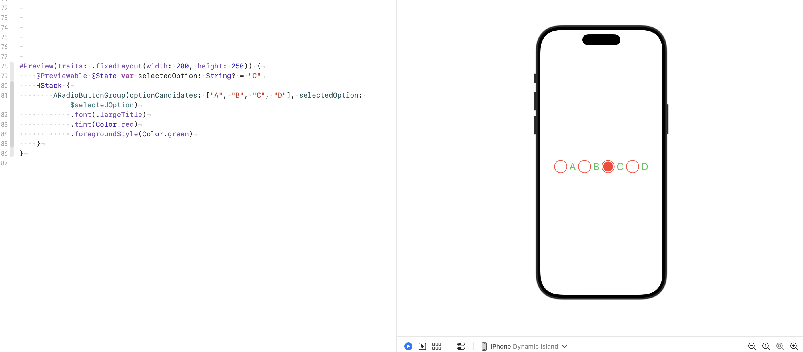
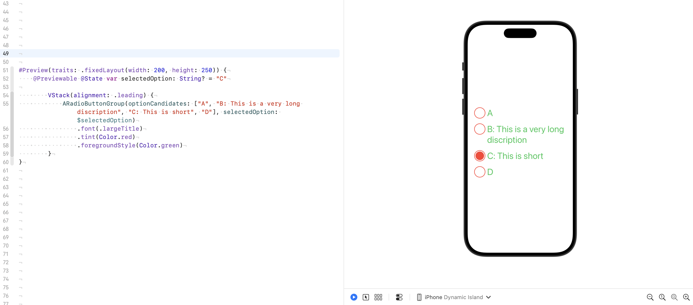

# ARadioButtonGroup

A lightweight, customizable **radio button group UI** for SwiftUI that works seamlessly on **macOS**, **iOS**, and **tvOS**.

`ARadioButtonGroup` makes it easy to present a group of mutually exclusive choices with a clean, platform-consistent look — while giving you full control over styling and behavior.

---

## ✨ Features

- 🎯 **Cross-platform** — Supports macOS, iOS, and tvOS.
- 🎨 **Customizable** — Easily change colors, fonts and selection style.
- 🛠 **SwiftUI-native** — Built entirely in SwiftUI, no UIKit/AppKit bridging required.
- ⚡ **Lightweight** — No external dependencies.
- 📦 **Swift Package Manager** support.
- 📝 **Multiline label support** — Text labels can span multiple lines, while the circle selection view dynamically matches the height of the first line for perfect alignment.

---

## 📦 Installation

### Swift Package Manager (SPM)
You can add **ARadioButtonGroup** to your project using Swift Package Manager:

1. In Xcode, go to **File > Add Packages...**
2. Paste the package URL: https://github.com/antonio081014/ARadioButtonGroup
3. Select the version and add it to your target.

Or add it manually to `Package.swift`:

```swift
dependencies: [
 .package(url: "https://github.com/antonio081014/ARadioButtonGroup.git", from: "1.3.0")
]
```

## 🚀 Usage

### Basic Example

```swift
import SwiftUI
import ARadioButtonGroup

struct ContentView: View {
    @State private var selectedOption: String? = "Option 1"

    let options = ["Option 1", "Option 2", "Option 3"]

    var body: some View {
        ARadioButtonGroup(
            optionCandidates: options,
            selectedOption: $selectedOption
        )
        .padding()
        .font(.largeTitle) // Modify Text Font
        .tint(Color.blue)   // Modify Circle Color
    }
}
```

Example: Radio Button Group in HStack


Example: Radio Button Group in VStack with multiline text supporting



## 🛡 License

This project is licensed under the MIT License.

## 🤝 Contributing

Pull requests are welcome!
If you find bugs or have feature requests, please open an issue.
